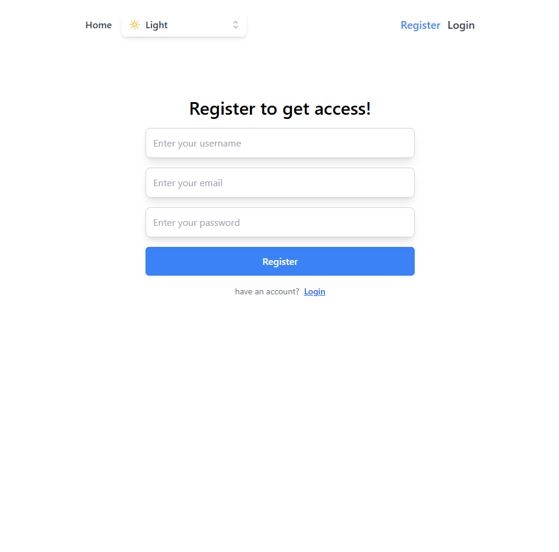
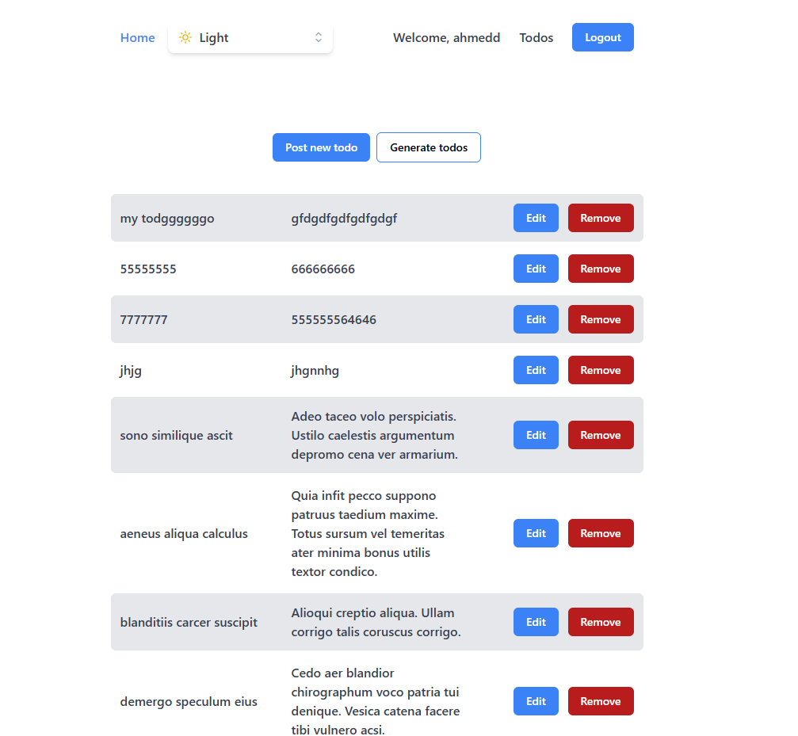
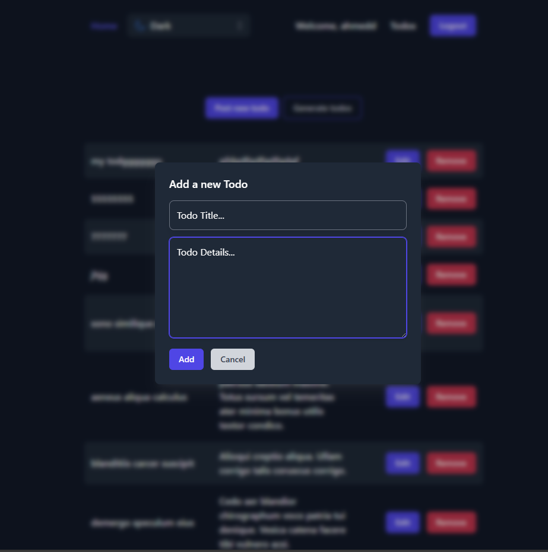
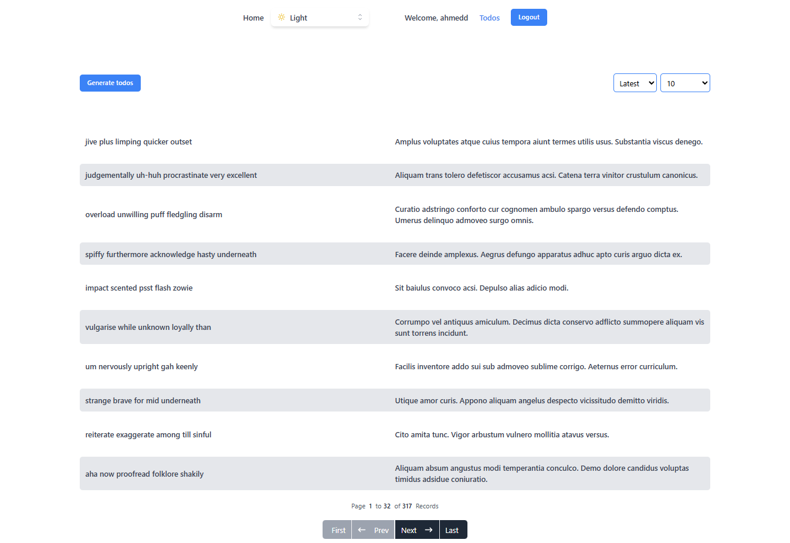
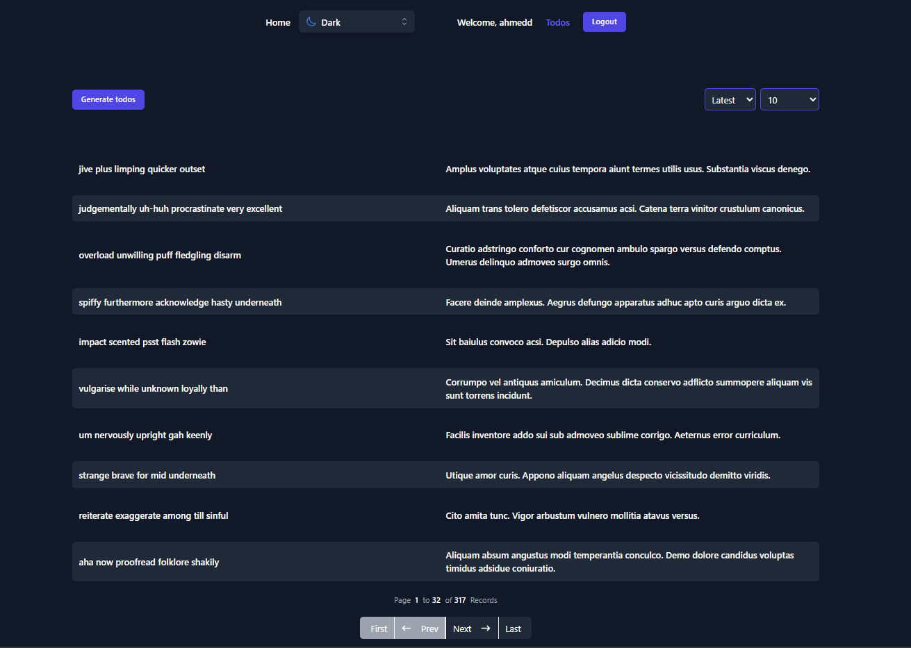

## 📝 Fullstack Todo App

A modern and responsive Todo Application with full authentication and CRUD capabilities. Built with **React, TypeScript, TailwindCSS** on the frontend and **Strapi** as a powerful headless CMS for the backend.

---

### 🔧 Tech Stack

#### Frontend

* ⚛️ React + TypeScript
* 🎨 TailwindCSS
* 🔄 React Query
* 🧭 React Router
* 📝 React Hook Form + Yup (validation)
* 🌙 Headless UI (modals, transitions)
* 🔥 React Hot Toast
* 📱 Axios

#### Backend

* 🚀 Strapi (Node.js headless CMS)

---

### 🚀 Features

* 🔐 **Authentication** (Register / Login)
* ✅ **Add, Edit, Delete** todos
* ⏳ **Pagination** with option to show X todos per page
* 📅 **Sort todos** by latest or oldest
* 💡 **Toggle Light/Dark Mode**
* ⚙️ **Persistent UI state**
* 🧪 **Generate fake todos**

---

### 📸 Screenshots

   
  <br /> 

   
  <br /> 
 
   
  <br /> 
 
   
  <br /> 

   
 
---

## 🚀 Live Demo

[🔗 View Live Demo]()

---

### 📦 Getting Started

#### 1. Clone the Repo

```bash
git clone https://github.com/ahmedragab15/Fullstack-Todo-App.git
cd fullstack-todo-app
```

#### 2. Start Backend

```bash
cd backend
npm install
npm run develop
```

#### 3. Start Frontend

```bash
cd frontend
npm install
npm run dev
```

> Make sure the backend runs at `http://localhost:1337` or update the `axios` base URL accordingly in the frontend config.